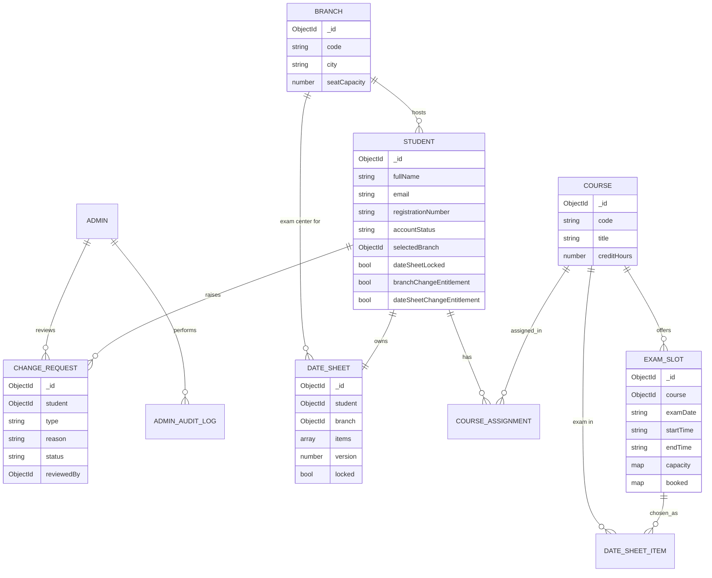

# ExamSlot

A self-service **examination date-sheet management platform** for a multi-branch virtual university.

Students are assigned courses by the administration, pick an examination branch **exactly once**, and build a conflict-free, capacity-aware exam schedule that is **locked on save**. Any later change requires a formal request that an administrator reviews and approves. Administrators manage branches, courses, students, assignments, exam slots, requests, and audit logs from a dedicated dashboard.

---

## Highlights

- **Two complete portals** — an admin console and a student portal, both responsive with light/dark themes.
- **Real business-rule enforcement on the server** — assignment limits (4–6), single branch selection, time-conflict detection, seat capacity, and date-sheet locking are all validated server-side. The client is never trusted.
- **Concurrency-safe seat booking** — per-branch seat capacity is enforced with atomic conditional MongoDB updates, so concurrent bookings cannot oversubscribe a slot.
- **Secure by default** — JWT in an `httpOnly` cookie, double-submit CSRF protection, Zod validation on every request, bcrypt password hashing, Helmet, and rate limiting.
- **Graceful email** — transactional email via Resend. When Resend is not configured the API reports an explicit `DISABLED` status instead of pretending to send.
- **Accountable** — privileged actions are written to an admin audit log.

---

## Tech Stack

| Layer      | Technology |
| ---------- | ---------- |
| Frontend   | React 18, Vite, Tailwind CSS, React Router, Axios, React Hook Form + Zod, Recharts, Sonner |
| Backend    | Node.js, Express (ESM), Mongoose |
| Database   | MongoDB |
| Auth       | JWT (`httpOnly` cookie) + double-submit CSRF cookie |
| Validation | Zod (body / query / params) |
| Email      | Resend |
| PDF        | pdfkit |
| Tooling    | Bun, Helmet, express-rate-limit |

---

## Repository Structure

```
ExamSlot/
├── client/                 # React + Vite frontend
│   └── src/
│       ├── api/            # axios client + typed endpoint wrappers
│       ├── components/     # UI kit, layouts, routing guards
│       ├── contexts/       # auth + theme providers
│       ├── hooks/          # data-fetching helpers
│       └── pages/          # admin/ · auth/ · student/ screens
└── server/                 # Express REST API
    ├── src/
    │   ├── config/         # env, db, constants
    │   ├── controllers/    # request handlers
    │   ├── middleware/     # auth, csrf, validate, rateLimit, error
    │   ├── models/         # Mongoose schemas
    │   ├── routes/         # route definitions
    │   ├── services/       # business logic
    │   ├── utils/          # helpers
    │   └── scripts/seed.js # demo data (resets the database)
    └── tests/              # business-rule integration tests
```

---

## Quick Start

### Prerequisites

- **Bun** ≥ 1.1 (or Node ≥ 18 + npm — the app is standard ESM)
- **MongoDB** running locally on `mongodb://127.0.0.1:27017`

> The default local setup uses a **standalone** `mongod`. Transactions are auto-detected: against a replica set / Atlas cluster the services use real transactions, and against a standalone they fall back to concurrency-safe atomic single-document updates. No configuration change is required.

### 1. Install

```bash
bun run install:all        # installs server + client dependencies
```

### 2. Configure

```bash
cp server/.env.example server/.env
cp client/.env.example client/.env
```

Edit `server/.env` and set a strong `JWT_SECRET`. Resend can be left blank (email runs in disabled mode).

### 3. Seed demo data

```bash
bun run seed
```

> The seed script **drops the database** and recreates a pristine demo dataset, then prints the credentials below.

### 4. Run

```bash
bun run dev:server         # API on http://localhost:5000
bun run dev:client         # UI  on http://localhost:5173
```

Open **http://localhost:5173**.

---

## Demo Credentials

| Role    | Email                        | Password             | Notes |
| ------- | ---------------------------- | -------------------- | ----- |
| Admin   | `admin@examslot.local`       | `Admin@ExamSlot123`  | Full admin console |
| Student | `bilal.ahmed@example.com`    | `Student@ExamSlot123`| Has a saved, **locked** date sheet |
| Student | `ayesha.khan@example.com`    | `Student@ExamSlot123`| Ready to build a date sheet |
| Student | `zainab.riaz@example.com`    | `Student@ExamSlot123`| Incomplete assignments + pending request |
| Student | `hamza.siddiqui@example.com` | _pending setup_      | Must set a password via the emailed setup link |

The seed also creates **3 branches, 8 courses, 24 exam slots, and 5 students**.

---

## Environment Variables

### `server/.env`

| Variable | Default | Description |
| -------- | ------- | ----------- |
| `NODE_ENV` | `development` | `development` \| `test` \| `production` |
| `PORT` | `5000` | API port |
| `MONGODB_URI` | `mongodb://127.0.0.1:27017/examslot` | MongoDB connection string |
| `JWT_SECRET` | — | **Required**, ≥ 16 chars |
| `JWT_EXPIRES_IN` | `2h` | Access-token lifetime |
| `CLIENT_URL` | `http://localhost:5173` | CORS origin + email link base |
| `UNIVERSITY_TIMEZONE` | `Asia/Karachi` | IANA timezone for slot calculations |
| `DEFAULT_EXAM_DURATION_MINUTES` | `180` | Fallback duration when a slot has no end time |
| `RESEND_API_KEY` | _(empty)_ | Leave blank to disable email |
| `RESEND_FROM_EMAIL` | — | Verified sender, e.g. `ExamSlot <no-reply@domain>` |
| `ADMIN_*`, `DEMO_STUDENT_PASSWORD` | — | Used by the seed script |

### `client/.env`

| Variable | Default | Description |
| -------- | ------- | ----------- |
| `VITE_API_URL` | `https://exam-slot-loopverse3-0.vercel.app/api` | Backend API base URL |

---

## Business Rules

1. **Assignments** — a student must be assigned between **4 and 6** courses before a date sheet can be created.
2. **Branch selection** — a student selects an examination branch **exactly once**. Re-selection is rejected (`BRANCH_ALREADY_SELECTED`) unless the student holds an approved `BRANCH_CHANGE` entitlement. An approved branch change **resets** the existing date sheet (releasing its seats) and lets the student choose again.
3. **Date sheet creation** — the student picks exactly one exam slot per assigned course. Selected slots are **reloaded server-side**; the client's times are never trusted.
4. **Time conflicts** — two exams overlap if `startA < endB && startB < endA`. Conflicting schedules are rejected with `TIME_CONFLICT`.
5. **Seat capacity** — each slot holds a per-branch number of seats. Booking/reserving is atomic; a full slot rejects the selection with `SLOT_FULL`.
6. **Locking** — a saved date sheet is immediately **locked**. Further edits require an approved `DATE_SHEET_CHANGE` request, which grants a **one-time** entitlement consumed on the next successful save.
7. **Change requests** — at most **one `PENDING` request per (student, type)** is allowed, enforced by a partial unique index. Requests can be approved/rejected **once**.
8. **Auditability** — admin actions (logins, CRUD, reviews) are recorded in an audit log.

---

## Data Model



`capacity` and `booked` are maps keyed by branch id, enabling per-branch seat limits while keeping seat accounting on a single document (which makes the conditional `$inc` atomic on a standalone MongoDB).

---

## API Overview

All routes are prefixed with `/api`.

| Group | Endpoints |
| ----- | --------- |
| **Auth** | `POST /auth/login`, `POST /auth/logout`, `GET /auth/me`, `GET /auth/csrf`, `POST /auth/forgot-password`, `POST /auth/set-password`, `POST /auth/reset-password` |
| **Branches** *(admin)* | `GET/POST /branches`, `GET/PATCH/DELETE /branches/:id`, `GET /branches/:id/dependencies` |
| **Courses** *(admin)* | `GET/POST /courses`, `GET/PATCH/DELETE /courses/:id`, `GET /courses/:id/dependencies` |
| **Students** *(admin)* | `GET/POST /students`, `GET/PATCH/DELETE /students/:id`, `PATCH /students/:id/status`, `POST /students/:id/resend-setup-email` |
| **Assignments** *(admin)* | `GET /assignments`, `GET/PUT /assignments/student/:studentId`, `POST /assignments`, `PATCH/DELETE /assignments/:id` |
| **Exam slots** *(admin)* | `GET/POST /exam-slots`, `GET/PATCH/DELETE /exam-slots/:id` |
| **Admin** | `GET /admin/dashboard`, `GET /admin/requests`, `GET /admin/requests/pending-summary`, `PATCH /admin/requests/:id/review`, `GET /admin/audit-logs` |
| **Student portal** | `GET /student/dashboard`, `GET /student/profile`, `GET /student/branches`, `POST /student/select-branch`, `GET /student/assignments`, `GET /student/exam-slots`, `GET /student/date-sheet`, `GET /student/date-sheet/builder`, `GET /student/date-sheet/pdf`, `POST/PATCH /student/date-sheet`, `GET/POST /student/requests` |

List endpoints return `{ success, data, pagination: { page, limit, totalItems, totalPages } }`.

---

## Security

- **Authentication** — JWT stored in an `httpOnly`, `SameSite=Lax` cookie (`Secure` in production).
- **CSRF** — double-submit cookie: state-changing requests must echo the `examslot_csrf` cookie value in the `x-csrf-token` header. Pre-auth endpoints are exempt and rate-limited.
- **Session invalidation** — tokens issued before `passwordChangedAt` are rejected.
- **Authorization** — role guards (`requireAdmin` / `requireStudent`); identity is always derived from the session, never from the request body.
- **Validation** — Zod schemas validate body, query, and params; `strict()` rejects unknown fields. List queries are allow-listed and search input is escaped.
- **Hardening** — Helmet security headers, CORS restricted to `CLIENT_URL`, request body size limits, and rate limiting on auth/password/request endpoints.

---

## Testing

Business-rule integration tests run against a dedicated `examslot_test` database (they never touch your development data):

```bash
bun run test        # from the repo root, or `bun test` inside server/
```

The suite covers CSRF enforcement, RBAC, single branch selection, the 4–6 assignment limit, time-conflict rejection, date-sheet locking, atomic seat capacity, the single-pending-request rule, one-time entitlement grants, single-use reviews, and index integrity.

---

## Scripts

| Command | Description |
| ------- | ----------- |
| `bun run install:all` | Install server + client dependencies |
| `bun run dev:server` | Start the API with hot reload |
| `bun run dev:client` | Start the Vite dev server |
| `bun run seed` | Drop + reseed demo data |
| `bun run test` | Run the backend business-rule tests |
| `bun run build` | Production build of the client |

---

## Design Decisions

- **Standalone-first, Atlas-ready** — no hard dependency on transactions. Seat booking and branch selection use atomic conditional updates that are correct on both standalone and replica-set deployments.
- **Server as the source of truth** — the student builder mirrors overlap logic for UX, but every save revalidates slots, ownership, conflicts, and capacity on the server.
- **Email is optional** — the whole app works without any email provider; delivery status is surfaced honestly (`SENT` / `FAILED` / `DISABLED`).
- **Time handling** — all slot math is anchored to a single university timezone (`Asia/Karachi` by default) with a configurable default exam duration.
